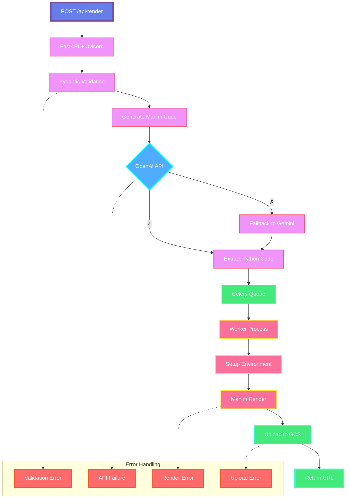

##  Animated Math Video Generator – System Architecture

This project enables users to input a math concept or prompt and receive a rendered video explanation using the [Manim](https://www.manim.community/) animation engine. It combines AI-based code generation (OpenAI/Gemini) with a modern Python-based backend and asynchronous rendering pipeline.

---

###  Tech Stack

* **FastAPI** – Lightweight web API framework
* **Uvicorn** – ASGI server for async performance
* **Pydantic** – Input validation
* **OpenAI API / Gemini** – AI code generation (fallback-enabled)
* **Celery** – Task queue manager for async video rendering
* **Manim** – Python-based mathematical animation engine
* **GCS (Google Cloud Storage)** – For storing and serving rendered videos
* **Redis** – Celery broker and caching (optional)

---

### System Flowchart (Mermaid)

---

### Error Handling Highlights

* **Validation Error:** Ensures malformed user inputs are caught early via Pydantic.
* **API Failure:** If OpenAI fails, Gemini is used as a fallback.
* **Render Error:** Manim environment issues are isolated and logged.
* **Upload Error:** Failures in uploading to cloud storage return structured error responses.

---

###  Future Enhancements

* Add support for video preview thumbnails
* User authentication + history dashboard
* Improve fallback logic and AI prompt design
* Include multilingual narration using TTS (text-to-speech)

